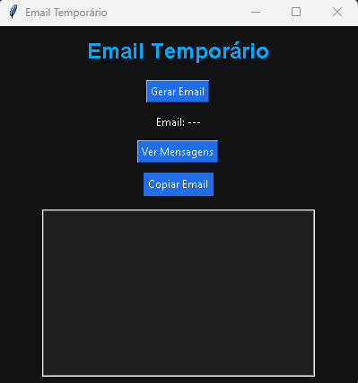

📧 Email Temporário em Python

Este projeto consiste em uma aplicação desenvolvida em Python que gera e-mails temporários de forma automática, permitindo o uso rápido para cadastros, testes e proteção contra spam.

🚀 Funcionalidades
Geração automática de e-mails temporários
Consulta de mensagens recebidas via API
Exibição de inbox diretamente no programa
Atualização de mensagens em tempo real (dependendo da API utilizada)
⚙️ Tecnologias utilizadas
Python 3
Requests (para consumo de API)
Tkinter (caso possua interface gráfica)
API de e-mail temporário (ex: Mail.tm ou similar)
🧠 Como funciona

O sistema gera um e-mail aleatório e utiliza uma API externa para criar e gerenciar a caixa de entrada. O programa consulta periodicamente essa API para verificar novas mensagens e exibi-las ao usuário.

📌 Objetivo do projeto

Este projeto foi desenvolvido com foco em prática de:

Consumo de APIs REST
Manipulação de dados em Python
Automação de processos
Interface gráfica (opcional)
🔧 Possíveis melhorias
Sistema de múltiplos e-mails
Armazenamento de mensagens em banco de dados
Atualização automática da inbox
Suporte a domínios personalizados
📄 Exemplo de uso
Executar o programa
Gerar um e-mail temporário
Utilizar o e-mail em cadastros
Verificar mensagens recebidas diretamente no sistema
📄 Exemplo de uso
- Executar o programa
- Gerar um e-mail temporário
- Utilizar o e-mail em cadastros
- Verificar mensagens recebidas diretamente no sistem

